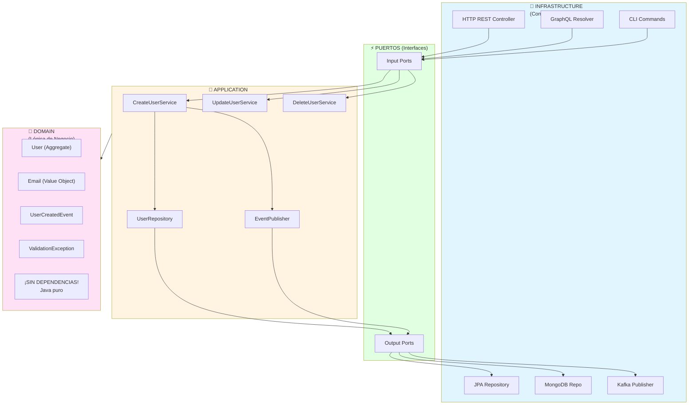
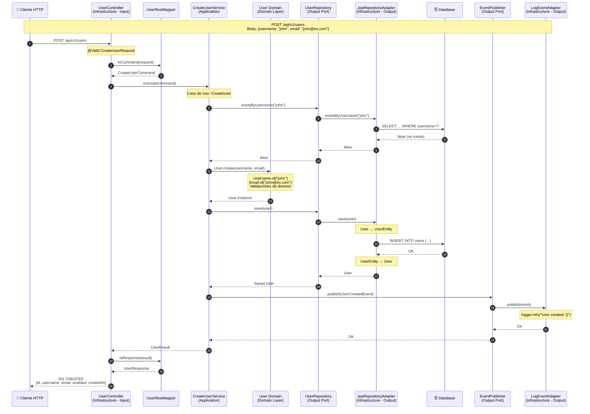
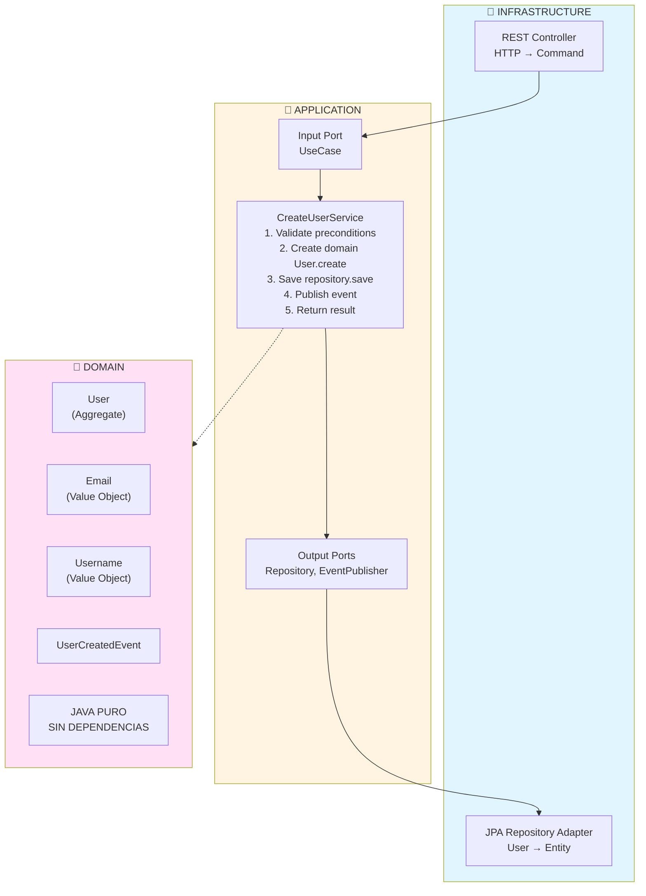
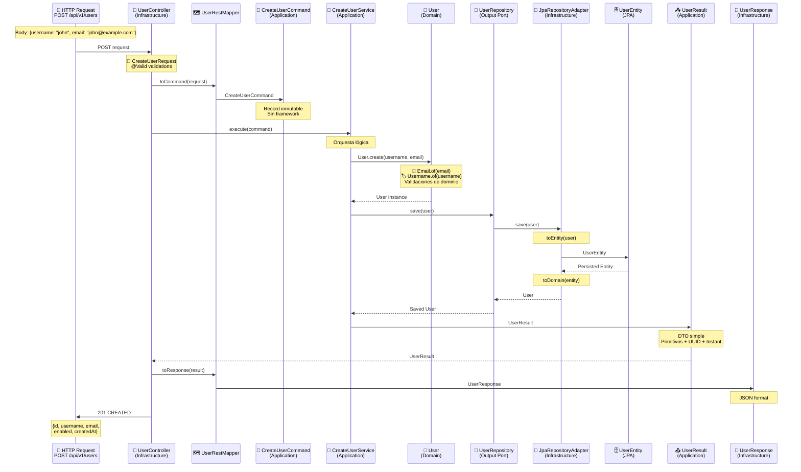
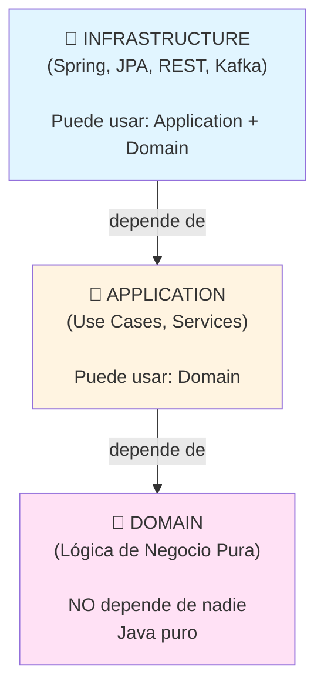

# Guía de Arquitectura Hexagonal para Juniors

## 📚 Índice

1. [¿Qué es la Arquitectura Hexagonal?](#qué-es-la-arquitectura-hexagonal)
2. [¿Por qué usarla?](#por-qué-usarla)
3. [Las 3 Capas](#las-3-capas)
4. [Puertos y Adaptadores](#puertos-y-adaptadores)
5. [Flujo Completo Paso a Paso](#flujo-completo-paso-a-paso)
6. [Estructura de Archivos](#estructura-de-archivos)
7. [Reglas de Dependencias](#reglas-de-dependencias)
8. [Ejemplos Prácticos](#ejemplos-prácticos)
9. [Errores Comunes](#errores-comunes)

---

## ¿Qué es la Arquitectura Hexagonal?

**Arquitectura Hexagonal** (también llamada **Ports & Adapters**) es una forma de organizar el código donde el **dominio del negocio** está en el centro y **protegido** de las tecnologías externas.

### Analogía: El Castillo

Imagina tu aplicación como un castillo:

```
        🏰 CASTILLO (Dominio)
           /          \
    🚪 PUERTA       🚪 PUERTA
    (Puertos)      (Puertos)
       |              |
    🔌 HTTP        🔌 Base de Datos
    (Adaptador)    (Adaptador)
```

- **Castillo**: Tu lógica de negocio (lo importante)
- **Puertas**: Interfaces que definen cómo entrar/salir (Puertos)
- **Adaptadores**: Tecnologías específicas (HTTP, SQL, Kafka, etc.)

**Ventaja clave:** Puedes cambiar las tecnologías (HTTP → GraphQL, SQL → MongoDB) sin tocar el castillo (dominio).

---

## ¿Por qué usarla?

### Problema Típico (Sin Arquitectura Hexagonal)

```java
// ❌ TODO MEZCLADO
@RestController
public class UserController {
    @Autowired
    private JpaUserRepository repository;  // Dependencia directa a JPA

    @PostMapping("/users")
    public ResponseEntity create(@RequestBody UserRequest request) {
        // Validación mezclada con HTTP
        if (request.username().length() < 3) {
            return ResponseEntity.badRequest().build();
        }

        // Lógica de negocio mezclada con persistencia
        UserEntity entity = new UserEntity();
        entity.setUsername(request.username());
        entity.setEmail(request.email());

        // ¿Y si queremos usar MongoDB? ¡Hay que cambiar TODO!
        repository.save(entity);

        return ResponseEntity.ok(entity);
    }
}
```

**Problemas:**
- 😵 Lógica de negocio, HTTP y BD todo junto
- 🔒 Imposible cambiar tecnologías sin reescribir todo
- 🐛 Difícil de testear (necesitas BD, servidor HTTP, etc.)
- 📦 Dependemos de Spring, JPA, etc. en todos lados

### Solución: Arquitectura Hexagonal



---

## Las 3 Capas

### 1. Domain (Dominio) 🏰 - EL CENTRO

**¿Qué es?**
El corazón de tu aplicación. Contiene las **reglas de negocio** puras.

**Responsabilidades:**
- ✅ Validar reglas de negocio (email válido, username único)
- ✅ Encapsular lógica de dominio (User.disable(), Order.addItem())
- ✅ Definir eventos de dominio (UserCreated, OrderPlaced)

**NO contiene:**
- ❌ Anotaciones de frameworks (@Entity, @Service, @RestController)
- ❌ Dependencias a Spring, JPA, Jackson, etc.
- ❌ Conocimiento de HTTP, BD, Kafka

**Archivos típicos:**
```
domain/
├── model/
│   └── User.java              # Aggregate Root
├── valueobject/
│   ├── Email.java             # Value Object
│   └── Username.java          # Value Object
├── event/
│   └── UserCreatedEvent.java  # Domain Event
└── exception/
    └── ValidationException.java
```

**Ejemplo:**
```java
// ✅ PURO: Sin dependencias
public class User {
    private final UUID id;
    private final Username username;  // Value Object
    private final Email email;        // Value Object

    public static User create(String username, String email) {
        // Validación de negocio
        Username usernameVO = Username.of(username);  // Valida
        Email emailVO = Email.of(email);              // Valida

        return new User(UUID.randomUUID(), usernameVO, emailVO);
    }

    public User disable() {
        // Regla de negocio: crear nueva instancia (inmutabilidad)
        return new User(this.id, this.username, this.email, false);
    }
}
```

---

### 2. Application (Aplicación) 🔄 - CASOS DE USO

**¿Qué es?**
La capa que **orquesta** la lógica de negocio. Define **QUÉ** hace la aplicación.

**Responsabilidades:**
- ✅ Definir casos de uso (CreateUser, UpdateOrder, ProcessPayment)
- ✅ Orquestar dominio y puertos
- ✅ Definir interfaces (puertos) que necesita

**NO hace:**
- ❌ Implementar tecnologías concretas (eso es Infrastructure)
- ❌ Saber SI es HTTP, GraphQL, CLI (es agnóstico)

**Estructura:**
```
application/
├── port/
│   ├── input/              # LO QUE LA APP OFRECE
│   │   ├── CreateUserUseCase.java      # Interface
│   │   ├── CreateUserCommand.java      # DTO entrada
│   │   └── UserResult.java             # DTO salida
│   └── output/             # LO QUE LA APP NECESITA
│       ├── UserRepository.java         # Interface
│       └── UserEventPublisher.java     # Interface
└── service/
    └── CreateUserService.java  # Implementa CreateUserUseCase
```

**Ejemplo - Input Port (lo que ofrece):**
```java
// Interface: define QUÉ hace (no CÓMO)
public interface CreateUserUseCase {
    UserResult execute(CreateUserCommand command);
}

// DTO: transporta datos entre capas
public record CreateUserCommand(String username, String email) {}
public record UserResult(UUID id, String username, String email, ...) {}
```

**Ejemplo - Output Port (lo que necesita):**
```java
// Interface: define lo que necesitamos (no cómo se implementa)
public interface UserRepository {
    User save(User user);
    Optional<User> findById(UUID id);
    boolean existsByUsername(String username);
}
```

**Ejemplo - Service:**
```java
@Service  // Única dependencia de framework
@Transactional
public class CreateUserService implements CreateUserUseCase {

    private final UserRepository userRepository;
    private final UserEventPublisher eventPublisher;

    // Constructor injection
    public CreateUserService(UserRepository repo, UserEventPublisher pub) {
        this.userRepository = repo;
        this.eventPublisher = pub;
    }

    @Override
    public UserResult execute(CreateUserCommand command) {
        // 1. Validar precondiciones
        if (userRepository.existsByUsername(command.username())) {
            throw new UserAlreadyExistsException(command.username());
        }

        // 2. Crear dominio (lógica de negocio)
        User user = User.create(command.username(), command.email());

        // 3. Persistir (output port)
        User savedUser = userRepository.save(user);

        // 4. Publicar evento (output port)
        UserCreatedEvent event = UserCreatedEvent.from(savedUser);
        eventPublisher.publish(event);

        // 5. Retornar resultado
        return new UserResult(savedUser.getId(), ...);
    }
}
```

**Nota importante:** La Application **define las interfaces** (puertos) pero **NO las implementa**. Eso lo hace Infrastructure.

---

### 3. Infrastructure (Infraestructura) 🔌 - ADAPTADORES

**¿Qué es?**
La capa de **tecnologías concretas**. Implementa los puertos usando frameworks y herramientas.

**Responsabilidades:**
- ✅ Implementar Input Ports (Controllers REST, GraphQL, CLI)
- ✅ Implementar Output Ports (Repositories JPA, MongoDB, APIs)
- ✅ Manejar detalles técnicos (HTTP, SQL, Kafka, Redis)

**Estructura:**
```
infrastructure/
├── adapter/
│   ├── input/              # ADAPTADORES DE ENTRADA
│   │   └── rest/
│   │       ├── UserController.java      # REST Controller
│   │       ├── dto/
│   │       │   ├── CreateUserRequest.java    # DTO HTTP
│   │       │   └── UserResponse.java         # DTO HTTP
│   │       └── mapper/
│   │           └── UserRestMapper.java
│   └── output/             # ADAPTADORES DE SALIDA
│       ├── persistence/
│       │   ├── JpaUserRepositoryAdapter.java  # Implementa UserRepository
│       │   ├── UserEntity.java                # JPA Entity
│       │   ├── SpringDataUserRepository.java  # Spring Data
│       │   └── mapper/
│       │       └── UserEntityMapper.java
│       └── event/
│           └── LogUserEventPublisherAdapter.java
└── config/
    └── BeanConfiguration.java  # Configuración Spring
```

**Ejemplo - Input Adapter (REST Controller):**
```java
@RestController
@RequestMapping("/api/v1/users")
public class UserController {

    private final CreateUserUseCase createUserUseCase;
    private final UserRestMapper mapper;

    public UserController(CreateUserUseCase useCase, UserRestMapper mapper) {
        this.createUserUseCase = useCase;
        this.mapper = mapper;
    }

    @PostMapping
    public ResponseEntity<UserResponse> createUser(
        @Valid @RequestBody CreateUserRequest request
    ) {
        // 1. Mapear REST DTO → Application Command
        CreateUserCommand command = mapper.toCommand(request);

        // 2. Ejecutar caso de uso
        UserResult result = createUserUseCase.execute(command);

        // 3. Mapear Application Result → REST DTO
        UserResponse response = mapper.toResponse(result);

        // 4. Retornar HTTP response
        return ResponseEntity.status(201).body(response);
    }
}
```

**Ejemplo - Output Adapter (JPA Repository):**
```java
@Repository
public class JpaUserRepositoryAdapter implements UserRepository {

    private final SpringDataUserRepository springDataRepo;
    private final UserEntityMapper mapper;

    public JpaUserRepositoryAdapter(SpringDataUserRepository repo, UserEntityMapper mapper) {
        this.springDataRepo = repo;
        this.mapper = mapper;
    }

    @Override
    public User save(User user) {
        // 1. Dominio → Entity JPA
        UserEntity entity = mapper.toEntity(user);

        // 2. Persistir con Spring Data
        UserEntity savedEntity = springDataRepo.save(entity);

        // 3. Entity JPA → Dominio
        return mapper.toDomain(savedEntity);
    }

    @Override
    public Optional<User> findById(UUID id) {
        return springDataRepo.findById(id)
            .map(mapper::toDomain);
    }
}
```

---

## Puertos y Adaptadores

### ¿Qué son los Puertos?

**Definición:** Interfaces que definen **contratos** de entrada/salida.

**Tipos:**

#### Input Ports (Puertos de Entrada)
**Lo que la aplicación OFRECE** al mundo exterior.

```java
// Application define el Input Port
public interface CreateUserUseCase {  // ← INPUT PORT
    UserResult execute(CreateUserCommand command);
}

// Infrastructure usa el Input Port
@RestController
public class UserController {
    private final CreateUserUseCase useCase;  // ← USA el puerto

    @PostMapping("/users")
    public ResponseEntity create(@RequestBody CreateUserRequest req) {
        return useCase.execute(...);  // ← LLAMA a través del puerto
    }
}
```

#### Output Ports (Puertos de Salida)
**Lo que la aplicación NECESITA** del mundo exterior.

```java
// Application define el Output Port
public interface UserRepository {  // ← OUTPUT PORT
    User save(User user);
    Optional<User> findById(UUID id);
}

// Application usa el Output Port
@Service
public class CreateUserService {
    private final UserRepository repository;  // ← USA el puerto

    public UserResult execute(CreateUserCommand command) {
        User user = User.create(...);
        repository.save(user);  // ← LLAMA a través del puerto
        return ...;
    }
}

// Infrastructure implementa el Output Port
@Repository
public class JpaUserRepositoryAdapter implements UserRepository {
    // Implementación concreta con JPA
}
```

### ¿Qué son los Adaptadores?

**Definición:** Implementaciones concretas de los puertos usando tecnologías específicas.

**Tipos:**

#### Input Adapters (Adaptadores de Entrada)
Implementan formas de **invocar** los casos de uso.

Ejemplos:
- `UserController` → REST HTTP
- `UserGraphQLResolver` → GraphQL
- `UserCLI` → Línea de comandos
- `UserKafkaConsumer` → Kafka messages

Todos invocan el mismo `CreateUserUseCase` pero de formas diferentes.

#### Output Adapters (Adaptadores de Salida)
Implementan las **necesidades** de la aplicación.

Ejemplos para `UserRepository`:
- `JpaUserRepositoryAdapter` → SQL con JPA
- `MongoUserRepositoryAdapter` → MongoDB
- `InMemoryUserRepository` → HashMap (para tests)
- `HttpUserRepositoryAdapter` → API externa

---

## Flujo Completo Paso a Paso

### Ejemplo: Crear un Usuario



**Pasos detallados:**

1. **PETICIÓN HTTP** (Infrastructure - Input Adapter): Cliente envía POST con datos
2. **VALIDACIÓN** (Infrastructure): `@Valid` valida `CreateUserRequest`
3. **MAPEO A COMMAND** (Infrastructure): Mapper convierte Request → Command
4. **INVOCAR CASO DE USO** (Application): Controller ejecuta `CreateUserService`
5. **VERIFICAR EXISTENCIA** (Application → Output Port): Chequea si username existe
6. **CONSULTAR BD** (Infrastructure - Output Adapter): JPA ejecuta SELECT
7-8. **RESPUESTA BD** (Infrastructure → Application): Username no existe
9. **CREAR DOMINIO** (Application → Domain): Invoca factory method `User.create()`
10. **VALIDAR DOMINIO** (Domain): Value Objects validan reglas de negocio
11. **DOMINIO CREADO** (Domain → Application): Retorna User válido
12. **PERSISTIR** (Application → Output Port): Solicita guardar User
13. **ADAPTAR A JPA** (Infrastructure): Convierte User → UserEntity
14. **INSERTAR EN BD** (Infrastructure): Ejecuta INSERT SQL
15-17. **CONFIRMACIÓN BD** (Infrastructure → Application): User persistido
18. **PUBLICAR EVENTO** (Application → Output Port): Notifica UserCreatedEvent
19. **LOG EVENTO** (Infrastructure): Logger registra el evento
20-21. **EVENTO PROCESADO** (Infrastructure → Application): Confirmación
22. **RETORNAR RESULTADO** (Application → Infrastructure): UserResult creado
23. **MAPEO A RESPONSE** (Infrastructure): Mapper convierte Result → Response
24. **RESPUESTA HTTP** (Infrastructure → Client): 201 CREATED con JSON

### Diagrama Visual del Flujo Simplificado



---

## Estructura de Archivos

### Estructura Completa del Proyecto

```
src/main/java/com/example/hexarch/
│
├── user/                                    ← Módulo de Usuario
│   │
│   ├── domain/                              ← CAPA 1: DOMINIO
│   │   ├── model/                           # Modelo de negocio
│   │   │   ├── User.java                    # Aggregate Root
│   │   │   └── valueobject/                 # Value Objects
│   │   │       ├── Email.java
│   │   │       └── Username.java
│   │   ├── event/                           # Domain Events
│   │   │   └── UserCreatedEvent.java
│   │   └── exception/                       # Domain Exceptions
│   │       ├── DomainException.java
│   │       ├── ValidationException.java
│   │       └── UserAlreadyExistsException.java
│   │
│   ├── application/                         ← CAPA 2: APLICACIÓN
│   │   ├── port/                            # Puertos (Interfaces)
│   │   │   ├── input/                       # Input Ports
│   │   │   │   ├── CreateUserUseCase.java  # Interface
│   │   │   │   ├── CreateUserCommand.java  # DTO entrada
│   │   │   │   └── UserResult.java         # DTO salida
│   │   │   └── output/                      # Output Ports
│   │   │       ├── UserRepository.java     # Interface
│   │   │       └── UserEventPublisher.java # Interface
│   │   └── service/                         # Implementación de Use Cases
│   │       └── CreateUserService.java      # implements CreateUserUseCase
│   │
│   └── infrastructure/                      ← CAPA 3: INFRAESTRUCTURA
│       └── adapter/                         # Adaptadores
│           ├── input/                       # Input Adapters
│           │   └── rest/                    # REST HTTP
│           │       ├── UserController.java
│           │       ├── dto/
│           │       │   ├── CreateUserRequest.java
│           │       │   └── UserResponse.java
│           │       └── mapper/
│           │           └── UserRestMapper.java
│           └── output/                      # Output Adapters
│               ├── persistence/             # Persistencia JPA
│               │   ├── JpaUserRepositoryAdapter.java
│               │   ├── UserEntity.java
│               │   ├── SpringDataUserRepository.java
│               │   └── mapper/
│               │       └── UserEntityMapper.java
│               └── event/                   # Publicación de eventos
│                   └── LogUserEventPublisherAdapter.java
│
└── shared/                                  ← Código compartido
    └── infrastructure/
        └── exception/
            ├── GlobalExceptionHandler.java
            └── ErrorResponse.java
```

---

## 🧩 Nomenclatura por Capa: DDD + Hexagonal + CQRS

Esta sección muestra **qué nombre** debe tener cada objeto según **en qué capa** esté y **qué propósito** tenga.

### 📋 Tabla de Nomenclatura (DDD + Hexagonal + CQRS)

| Capa | Tipo de objeto | Ejemplo | Propósito |
|------|----------------|---------|-----------|
| **Controller (in)** | Request DTO | `CreateUserRequest` | Datos de entrada HTTP. Validación inicial. |
| **Application (in)** | Command | `CreateUserCommand` | Intención del caso de uso (crear, actualizar, etc.). |
| **Domain** | Aggregate Root / Entity | `User` | Modelo de negocio con lógica y reglas. |
| **Persistence (Infraestructura)** | Entity (ORM) | `UserEntity` | Representación técnica para la base de datos. |
| **Application (out)** | Result DTO | `UserResult` | Resultado del caso de uso. No expone dominio. |
| **Controller (out)** | Response DTO | `UserResponse` | Datos de salida HTTP. |

---

### ⚙️ Mapeos entre capas (dirección típica)

```
Entrada:
CreateUserRequest  →  CreateUserCommand  →  User  →  UserEntity

Salida:
UserEntity  →  User  →  UserResult  →  UserResponse
```

---

### 💡 Reglas de naming y buenas prácticas

1. **Request / Response** → Solo en la capa **Controller** (interfaz HTTP o API).
2. **Command / Query / Result** → Solo en la capa **Application** (casos de uso CQRS).
3. **Entity / Aggregate / ValueObject** → Solo en la capa **Domain**.
4. **Entity (persistencia)** → Solo en **Infraestructura**, aislada del dominio.
5. **Un modelo por capa**, con mapeos explícitos entre ellos.
6. **Naming claro y consistente**: cada sufijo indica su capa y propósito.

---

### ✅ Ejemplo completo de naming coherente

| Capa | Input | Output |
|------|-------|--------|
| **Controller** | `CreateUserRequest` | `UserResponse` |
| **Application** | `CreateUserCommand` | `UserResult` |
| **Domain** | `User` | `User` |
| **Persistence** | `UserEntity` | `UserEntity` |

---

### 🎯 Regla final

> Usa **Request** / **Command** / **Entity** / **Result** / **Response** según su capa.
>
> Cada uno representa una **frontera diferente** y mantiene el **dominio puro y desacoplado**.

---

### Tabla de Nomenclatura Completa (Detallada)

| Capa | Tipo de Objeto | Ejemplo | Propósito |
|------|----------------|---------|-----------|
| **Controller (in)** | Request DTO | `CreateUserRequest` | Datos de entrada HTTP. Validación inicial con Bean Validation |
| **Application (in)** | Command | `CreateUserCommand` | Intención del caso de uso (crear, actualizar, etc.) |
| **Application (in)** | Query | `GetUserQuery` | Intención de consulta (leer datos) |
| **Domain** | Aggregate Root / Entity | `User` | Modelo de negocio con lógica y reglas |
| **Persistence** | Entity (ORM) | `UserEntity` | Representación técnica para la base de datos |
| **Application (out)** | Result DTO | `UserResult` | Resultado del caso de uso. No expone dominio |
| **Controller (out)** | Response DTO | `UserResponse` | Datos de salida HTTP |

### 📊 Flujo de Mapeos Entre Capas



### 🔄 Resumen de Mapeos (Dirección Típica)

```
Entrada:
CreateUserRequest → CreateUserCommand → User → UserEntity

Salida:
UserEntity → User → UserResult → UserResponse
```

### 💡 Reglas de Naming y Buenas Prácticas

| # | Regla | Explicación |
|---|-------|-------------|
| 1 | **Request / Response** | Solo en la capa **Controller** (interfaz HTTP o API) |
| 2 | **Command / Query / Result** | Solo en la capa **Application** (casos de uso CQRS) |
| 3 | **Entity / Aggregate / ValueObject** | Solo en la capa **Domain** |
| 4 | **Entity (persistencia)** | Solo en **Infrastructure**, aislada del dominio |
| 5 | **Un modelo por capa** | Con mapeos explícitos entre ellos (evita acoplamiento) |
| 6 | **Naming claro y consistente** | Cada sufijo indica su capa y propósito |

### ✅ Ejemplo Completo de Naming Coherente

| Capa | Input | Output |
|------|-------|--------|
| **Controller** | `CreateUserRequest` | `UserResponse` |
| **Application** | `CreateUserCommand` | `UserResult` |
| **Domain** | `User` | `User` |
| **Persistence** | `UserEntity` | `UserEntity` |

### 🎯 Regla Final

> Usa **Request** / **Command** / **Entity** / **Result** / **Response** según su capa.
> Cada uno representa una **frontera diferente** y mantiene el **dominio puro y desacoplado**.

### 📦 Archivos Involucrados en el Flujo CreateUser

```
src/main/java/com/example/hexarch/user/

infrastructure/adapter/input/rest/
├── UserController.java                      ← 1. Recibe HTTP Request
├── dto/
│   ├── CreateUserRequest.java              ← 2. DTO de entrada HTTP
│   └── UserResponse.java                    ← 10. DTO de salida HTTP
└── mapper/
    └── UserRestMapper.java                  ← 3. Mapea Request→Command, Result→Response

application/port/input/
├── CreateUserUseCase.java                   ← 4. Interface del caso de uso
├── CreateUserCommand.java                   ← DTO de entrada (Application)
└── UserResult.java                          ← 9. DTO de salida (Application)

application/service/
└── CreateUserService.java                   ← 5. Implementa el caso de uso

domain/model/
├── User.java                                ← 6. Aggregate Root (lógica de negocio)
└── valueobject/
    ├── Email.java                           ← Value Object
    └── Username.java                        ← Value Object

application/port/output/
├── UserRepository.java                      ← Interface del repositorio (Output Port)
└── UserEventPublisher.java                  ← Interface del publicador de eventos

infrastructure/adapter/output/persistence/
├── JpaUserRepositoryAdapter.java            ← 7. Implementa UserRepository
├── UserEntity.java                          ← 8. Entidad JPA (tabla BD)
├── SpringDataUserRepository.java            ← JPA Repository de Spring Data
└── mapper/
    └── UserEntityMapper.java                ← Mapea User↔UserEntity

infrastructure/adapter/output/event/
└── LogUserEventPublisherAdapter.java        ← Implementa UserEventPublisher

domain/event/
└── UserCreatedEvent.java                    ← Evento de dominio

domain/exception/
├── DomainException.java                     ← Excepciones de dominio
├── ValidationException.java
└── UserAlreadyExistsException.java

shared/infrastructure/exception/
├── GlobalExceptionHandler.java              ← Manejo global de excepciones
└── ErrorResponse.java                       ← DTO de error estándar
```

**Orden de ejecución (números en el flujo):**
1. `UserController` recibe HTTP POST
2. Deserializa JSON → `CreateUserRequest`
3. `UserRestMapper` convierte Request → `CreateUserCommand`
4. Invoca `CreateUserUseCase.execute(command)`
5. `CreateUserService` ejecuta la lógica
6. Crea `User` (domain) usando `User.create()`
7. Usa `UserRepository.save()` (implementado por `JpaUserRepositoryAdapter`)
8. Convierte `User` → `UserEntity` (JPA)
9. Retorna `User` → convierte a `UserResult`
10. `UserRestMapper` convierte Result → `UserResponse`
11. Devuelve HTTP 201 CREATED

---

### ¿Dónde va cada tipo de clase?

| Tipo | Capa | Paquete | Ejemplo |
|------|------|---------|---------|
| **Entity/Aggregate** | Domain | `domain/model/` | `User.java` |
| **Value Object** | Domain | `domain/model/valueobject/` | `Email.java` |
| **Domain Event** | Domain | `domain/event/` | `UserCreatedEvent.java` |
| **Domain Exception** | Domain | `domain/exception/` | `ValidationException.java` |
| **Use Case Interface** | Application | `application/port/input/` | `CreateUserUseCase.java` |
| **Command/Query** | Application | `application/port/input/` | `CreateUserCommand.java` |
| **Result DTO** | Application | `application/port/input/` | `UserResult.java` |
| **Repository Interface** | Application | `application/port/output/` | `UserRepository.java` |
| **Service** | Application | `application/service/` | `CreateUserService.java` |
| **REST Controller** | Infrastructure | `infrastructure/adapter/input/rest/` | `UserController.java` |
| **REST DTO** | Infrastructure | `infrastructure/adapter/input/rest/dto/` | `CreateUserRequest.java` |
| **JPA Entity** | Infrastructure | `infrastructure/adapter/output/persistence/` | `UserEntity.java` |
| **Repository Adapter** | Infrastructure | `infrastructure/adapter/output/persistence/` | `JpaUserRepositoryAdapter.java` |

---

## Reglas de Dependencias

### La Regla de Oro

```
Infrastructure → Application → Domain

Las flechas indican "depende de"
```

**PERMITIDO:**
- ✅ Infrastructure puede depender de Application
- ✅ Infrastructure puede depender de Domain
- ✅ Application puede depender de Domain

**PROHIBIDO:**
- ❌ Domain NO puede depender de Application
- ❌ Domain NO puede depender de Infrastructure
- ❌ Application NO puede depender de Infrastructure

### Visualización



### ¿Por qué estas reglas?

**Razón:** Si el Domain no depende de nada, puedes:
- ✅ Testear sin frameworks (tests rápidos)
- ✅ Cambiar tecnologías sin tocar el dominio
- ✅ Reutilizar el dominio en diferentes contextos

### Inversión de Dependencias

**Problema:** Application necesita persistencia, pero no puede depender de Infrastructure.

**Solución:** Application define la **interfaz**, Infrastructure la **implementa**.

```java
// Application define lo que necesita
package application.port.output;

public interface UserRepository {  // ← Interface en Application
    User save(User user);
}

// Application la usa
package application.service;

public class CreateUserService {
    private final UserRepository repository;  // ← Usa la interface

    public UserResult execute(CreateUserCommand command) {
        User user = User.create(...);
        repository.save(user);  // ← No sabe CÓMO se guarda
        return ...;
    }
}

// Infrastructure la implementa
package infrastructure.adapter.output.persistence;

@Repository
public class JpaUserRepositoryAdapter implements UserRepository {  // ← Implementa
    // Implementación con JPA
    public User save(User user) {
        // Lógica de JPA aquí
    }
}
```

**Resultado:** Application depende de la interfaz (que está en Application), no de la implementación.

---

## Ejemplos Prácticos

### Ejemplo 1: Agregar un Nuevo Endpoint

**Tarea:** Agregar `GET /users/{id}`

**Pasos:**

1. **Application - Crear Input Port:**
```java
// application/port/input/GetUserUseCase.java
public interface GetUserUseCase {
    UserResult execute(UUID userId);
}
```

2. **Application - Crear Service:**
```java
// application/service/GetUserService.java
@Service
public class GetUserService implements GetUserUseCase {
    private final UserRepository repository;

    public UserResult execute(UUID userId) {
        User user = repository.findById(userId)
            .orElseThrow(() -> new UserNotFoundException(userId));
        return new UserResult(...);
    }
}
```

3. **Infrastructure - Agregar en Controller:**
```java
// infrastructure/adapter/input/rest/UserController.java
@GetMapping("/{id}")
public ResponseEntity<UserResponse> getUser(@PathVariable UUID id) {
    UserResult result = getUserUseCase.execute(id);
    UserResponse response = mapper.toResponse(result);
    return ResponseEntity.ok(response);
}
```

**Nota:** ¡No tocamos el Domain!

### Ejemplo 2: Cambiar de JPA a MongoDB

**Tarea:** Usar MongoDB en lugar de JPA

**Pasos:**

1. **NO tocar Domain** ✅
2. **NO tocar Application** ✅
3. **Crear nuevo adapter en Infrastructure:**

```java
// infrastructure/adapter/output/persistence/MongoUserRepositoryAdapter.java
@Repository
public class MongoUserRepositoryAdapter implements UserRepository {

    @Autowired
    private MongoTemplate mongoTemplate;

    public User save(User user) {
        UserDocument doc = toDocument(user);
        mongoTemplate.save(doc, "users");
        return toDomain(doc);
    }

    // ... otros métodos
}
```

4. **Configurar Spring para usar el nuevo adapter:**

```java
@Configuration
public class MongoConfig {
    @Bean
    @Primary  // Usa este en lugar del JPA
    public UserRepository mongoUserRepository() {
        return new MongoUserRepositoryAdapter();
    }
}
```

**Resultado:** Cambiamos la tecnología sin tocar lógica de negocio.

### Ejemplo 3: Agregar GraphQL además de REST

**Tarea:** Exponer los mismos casos de uso por GraphQL

**Pasos:**

1. **NO tocar Domain** ✅
2. **NO tocar Application** ✅ (¡Reutilizamos los Use Cases!)
3. **Crear nuevo Input Adapter:**

```java
// infrastructure/adapter/input/graphql/UserGraphQLResolver.java
@Component
public class UserGraphQLResolver implements GraphQLQueryResolver {

    private final CreateUserUseCase createUserUseCase;
    private final GetUserUseCase getUserUseCase;

    public UserResponse createUser(CreateUserInput input) {
        CreateUserCommand command = toCommand(input);
        UserResult result = createUserUseCase.execute(command);  // ¡Mismo Use Case!
        return toGraphQLResponse(result);
    }
}
```

**Resultado:** Dos tecnologías (REST y GraphQL) usando la misma lógica.

---

## Errores Comunes

### ❌ Error 1: Domain depende de Infrastructure

```java
// MAL: Domain importando Spring
import org.springframework.stereotype.Component;

@Component  // ❌ Domain no debe tener @Component
public class User {
    // ...
}
```

**Solución:** Domain es Java puro, sin anotaciones de frameworks.

### ❌ Error 2: Application implementa tecnologías concretas

```java
// MAL: Application implementando JPA directamente
@Service
public class CreateUserService {
    @Autowired
    private EntityManager entityManager;  // ❌ No JPA en Application

    public void execute(CreateUserCommand command) {
        entityManager.persist(...);  // ❌
    }
}
```

**Solución:** Application usa interfaces (puertos), no tecnologías.

```java
// BIEN: Application usa interface
@Service
public class CreateUserService {
    private final UserRepository repository;  // ✅ Interface

    public void execute(CreateUserCommand command) {
        repository.save(...);  // ✅
    }
}
```

### ❌ Error 3: Lógica de negocio en Infrastructure

```java
// MAL: Validación en el Controller
@PostMapping("/users")
public ResponseEntity create(@RequestBody CreateUserRequest request) {
    if (request.username().length() < 3) {  // ❌ Lógica en Controller
        return ResponseEntity.badRequest().build();
    }
    // ...
}
```

**Solución:** Lógica en Domain, Controller solo coordina.

```java
// BIEN: Controller delega al Use Case
@PostMapping("/users")
public ResponseEntity create(@RequestBody CreateUserRequest request) {
    CreateUserCommand command = mapper.toCommand(request);
    UserResult result = createUserUseCase.execute(command);  // ✅
    return ResponseEntity.ok(mapper.toResponse(result));
}

// Lógica en Domain
public class Username {
    public static Username of(String value) {
        if (value.length() < 3) {  // ✅ Validación en Domain
            throw new ValidationException("Too short");
        }
        return new Username(value);
    }
}
```

### ❌ Error 4: DTOs del Domain expuestos directamente en REST

```java
// MAL: Exponer objetos de Domain en REST
@PostMapping("/users")
public ResponseEntity<User> create(...) {  // ❌ User es del Domain
    User user = createUserUseCase.execute(...);
    return ResponseEntity.ok(user);  // ❌ Expone User directamente
}
```

**Problema:** Si cambias User (domain), rompes el contrato de la API.

**Solución:** Usar DTOs específicos de Infrastructure.

```java
// BIEN: DTOs separados
@PostMapping("/users")
public ResponseEntity<UserResponse> create(...) {  // ✅ UserResponse de Infrastructure
    UserResult result = createUserUseCase.execute(...);
    UserResponse response = mapper.toResponse(result);  // ✅ Mapeo
    return ResponseEntity.ok(response);
}
```

---

## Beneficios de Arquitectura Hexagonal

### 1. Testabilidad

```java
// Test del Domain - Sin frameworks
@Test
void shouldValidateEmail() {
    assertThrows(ValidationException.class, () -> {
        Email.of("invalid-email");
    });
}

// Test del Service - Mocks de interfaces
@Test
void shouldCreateUser() {
    // Arrange
    UserRepository mockRepo = mock(UserRepository.class);
    CreateUserService service = new CreateUserService(mockRepo, ...);

    // Act
    service.execute(new CreateUserCommand("john", "john@ex.com"));

    // Assert
    verify(mockRepo).save(any(User.class));
}
```

### 2. Flexibilidad

Puedes cambiar tecnologías sin reescribir:
- REST → GraphQL
- JPA → MongoDB
- Kafka → RabbitMQ
- Síncrono → Asíncrono

### 3. Mantenibilidad

- Código organizado y claro
- Fácil encontrar cosas (cada tipo de clase en su lugar)
- Cambios localizados (cambiar REST no afecta Domain)

### 4. Reutilización

- Mismos Use Cases para REST, GraphQL, CLI
- Mismo Domain para diferentes contextos
- Adapters intercambiables

---

## Resumen en una Página

```
┌────────────────────────────────────────────────────────────────┐
│                  ARQUITECTURA HEXAGONAL                         │
└────────────────────────────────────────────────────────────────┘

CAPAS:
------
1. DOMAIN (Centro)
   • Lógica de negocio pura
   • Java puro, sin frameworks
   • Entities, Value Objects, Events

2. APPLICATION (Casos de Uso)
   • Orquesta el dominio
   • Define puertos (interfaces)
   • Services, Use Cases, Commands

3. INFRASTRUCTURE (Tecnologías)
   • Implementa puertos
   • Controllers, Repositories, APIs
   • Spring, JPA, Kafka, etc.

REGLAS:
-------
✅ Infrastructure → Application → Domain
❌ Domain NUNCA depende de Application o Infrastructure
✅ Application define interfaces, Infrastructure implementa

VENTAJAS:
---------
• Testeable: Domain sin frameworks
• Flexible: Cambiar tecnologías fácilmente
• Mantenible: Código organizado
• Reutilizable: Mismos Use Cases para diferentes entradas

CUANDO USAR:
------------
✅ Proyectos medianos/grandes
✅ Dominio complejo
✅ Necesitas cambiar tecnologías
✅ Quieres tests rápidos

❌ CRUD simple (puede ser overkill)
```

---

## Recursos para Seguir Aprendiendo

1. **Libro:** "Implementing Domain-Driven Design" - Vaughn Vernon (Capítulo 4: Architecture)
2. **Artículo:** [Hexagonal Architecture](https://alistair.cockburn.us/hexagonal-architecture/) - Alistair Cockburn (el creador)
3. **Video:** "Clean Architecture" - Robert C. Martin (Uncle Bob)
4. **Blog:** [Hexagonal Architecture with Spring Boot](https://reflectoring.io/spring-hexagonal/)

---

**¡Recuerda!** La arquitectura es una herramienta, no un fin. Úsala cuando aporte valor. 🎯
